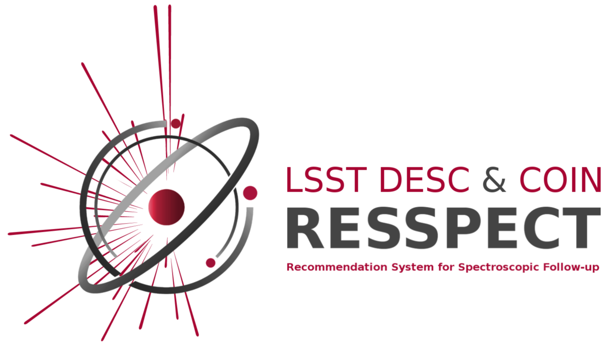

#  RESSPECT

## ActSNClass - RESSPECT version 

This repository holds the pipeline for the RESSPECT project (REcommendation System for SPECTroscopic follow-up).

It grew from the work developed by COIN in the [ActSNClass](https://github.com/COINtoolbox/ActSNClass) package.

Full documentation can be found at [readthedocs](https://actsnclass.readthedocs.io/en/resspect/index.html).

# Dependencies

### For code:

 - Python>=3.7  
 - argparse>=1.1  
 - astropy>=4.0  
 - matplotlib>=3.1.1  
 - numpy>=1.17.0  
 - pandas>=0.25.0  
 - setuptools>=41.0.1  
 - scipy>=1.3.0  
 - scikit-learn>=0.20.3  
 - seaborn>=0.9.0  
 
 
 ### For documentation:
 
  - sphinx>=2.1.2

# Install

The current version runs in Python-3.7 or higher and it was not tested on Windows.  

We recommend that you work within a [virtual environment](https://packaging.python.org/guides/installing-using-pip-and-virtual-environments/).  
 
You will need to install the `Python` package ``virtualenv``. In MacOS or Linux, do

    >> python3 -m pip install --user virtualenv

Navigate to a ``env_directory`` where you will store the new virtual environment and create it  

    >> python3 -m venv ActSNClass  

> Make sure you deactivate any ``conda`` environment you might have running before moving forward.   

Once the environment is set up you can activate it,

    >> source <env_directory>/bin/activate  

You should see a ``(ActSNClass)`` flag in the extreme left of terminal command line.   

Next, clone this repository in another chosen location:  

    (ActSNClass) >> git clone -b RESSPECT https://github.com/COINtoolbox/ActSNClassgit s.git  

Navigate to the repository folder and do  

    (ActSNClass) >> pip install -r requirements.txt  

You can now install this package with:  

    (ActSNClass) >>> python setup.py develop  

> You may choose to create your virtual environment within the folder of the repository. If you choose to do this, you must remember to exclude the virtual environment directory from version control using e.g., ``.gitignore``.   

