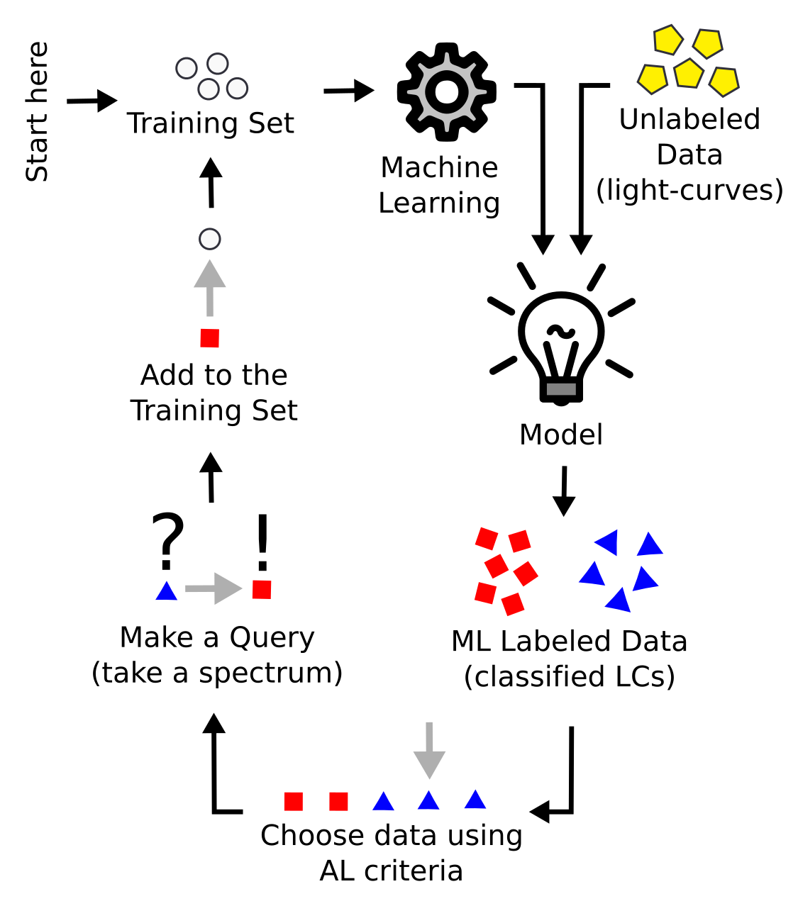

.. actsnclass documentation master file, created by
   sphinx-quickstart on Thu Aug  8 16:11:41 2019.

=======================
Welcome to actsnclass !
=======================
--------------------------------------------------------
Active Learning for Supernova Photometric Classification
--------------------------------------------------------

This tool allows you to reproduce the results presented in `Ishida et al., 2019 <https://cosmostatistics-initiative.org/portfolio-item/active-learning-for-sn-classification/>`_.
It was based on the original prototype developed during the `COIN Residence Program #4 <http://iaacoin.wixsite.com/crp2017/>`_ , which took place in Clermont Ferrand, France, August 2017.

The code has been updated to allow a friendly use and expansion.

Getting started
===============

In order to setup a suitable working environment, clone this repository and make sure you have the necessary packages installed.

Dependencies
------------

``actsnclass`` was developed under ``Python3``. The complete list of dependencies is given below:

 - Python>=3.7
 - matplotlib>=3.1.1
 - numpy>=1.17.0
 - pandas>=0.25.0
 - setuptools>=41.0.1
 - scipy>=1.3.0
 - sklearn>=0.20.3
 - seaborn>=0.9.0

Installing
----------

Clone this repository,

.. code-block:: bash

    >>> git clone https://github.com/COINtoolbox/ActSNClass

We recommend the use of Anaconda environments to ensure the proper version of all dependencies are
installed and do not interfere in your other applications. You can find instructions on how to install
it `here <https://docs.anaconda.com/anaconda/install/>`_.

If you wish to use this option, simple navigate to the directory of the repository and do:

.. code-block:: python

    >>> conda env create -f environment.yml

Once the environment is set up you can activate it:

.. code-block:: python

   >>> conda activate ActSNClass

If everything goes well you will see the name of the environment in the left most side of your command line.

You can now install `actsnclass` with:

.. code-block:: bash

    (ActSNClass)  >> python setup.py install

Setting up a working directory
------------------------------

In another location of your choosing, create the following directory structure:

::

    work_dir
    ├── plots
    ├── results

The outputs of ``actsnclass`` will be stored in these directories.

In order to set things properly, from the repository you just cloned, and move the data directory to your
chosen working directory and unpack the data.

.. code-block:: bash

    >>> mv -f actsnclass/data/ work_dir/
    >>> cd work_dir/data
    >>> tar -xzvf SIMGEN_PUBLIC_DES.tar.gz

This data was provided by Rick Kessler, after the publication of results from the
`SuperNova Photometric Classification Challenge <https://arxiv.org/abs/1008.1024>`_.

Analysis steps
==============

The ``actsnclass`` pipeline is composed of 4 important steps:

1. Feature extraction

2. Classifier

3. Query Strategy

4. Metric evaluation

These are arranged in the adaptable learning process (figure to the right).

Using this package
------------------

Step 1 is considered pre-processing. The current code does the feature extraction
using the `Bazin parametric function <https://arxiv.org/abs/0904.1066>`_ for the complete training and test sample
before any machine learning application is used.

Details of the tools available to evaluate different steps on feature extraction can be found in the
:ref:`Feature extraction page <preprocessing>`.

Alternatively, you can also perform the full light curve fit for the entire sample from the command line:

.. code-block:: bash

    >>> fit_dataset.py -dd <path_to_data_dir> -o <output_file>

Once the data has been processed you can apply the full Active Learning loop according to your needs.
A detail description on how to use this tool is provided in the :ref:`Learning Loop page <learnloop>`.

The command line option require a few more inputs than the feature extraction stage, but it is also available:

.. code-block:: bash

   >>> run_loop.py -i <input features file> -b <batch size> -n <number of loops>
   >>>             -d <output metrics file> -q <output queried sample file>
   >>>             -s <learning strategy> -t <choice of initial training>

We also provide detail explanation on how to use this package to produce other stages of the pipeline like:
:ref:`prepare the Canonical sample <canonical>`, :ref:`prepare data for time domain <timedomain>` and
:ref:`produce plots <plotting>`.

We also provide detail descriptions on how to contribute with other modules in the
:ref:`How to contribute <contribute>` tab.

Enjoy!!

Acknowledgements
****************

This work is heavily based on the first prototype developed  during COIN Residence Program (`CRP#4 <https://iaacoin.wixsite.com/crp2017>`_), held in Clermont Ferrand, France, 2017 and financially supported by `Universite Clermont Auvergne <https://en.uca.fr/english-version/>`_ and `La Region Auvergne-Rhone-Alpes <https://www.auvergnerhonealpes.fr/>`_. We thank Emmanuel Gangler for encouraging the realization of this event.

The `COsmostatistics INitiative (COIN) <https://cosmostatistics-initiative.org>`_ receives financial support from `CNRS <http://www.cnrs.fr/>`_ as part of its MOMENTUM programme over the 2018-2020 period, under the project *Active Learning for Large Scale Sky Surveys*.

This work would not be possible without intensive consultation to online platforms and
discussion forums. Although it is not possible to provide a complete list of the open source
material consulted in the construction of this material, we recognize their importance and
**deeply thank all those who contributes to open learning platforms**.

Table of Contents
=================

.. toctree::
   :maxdepth: 2

   pre_processing
   canonical
   prepare_time_domain
   learn_loop
   plotting
   contribute
   reference

Indices and tables
==================

* :ref:`genindex`
* :ref:`modindex`
* :ref:`search`
