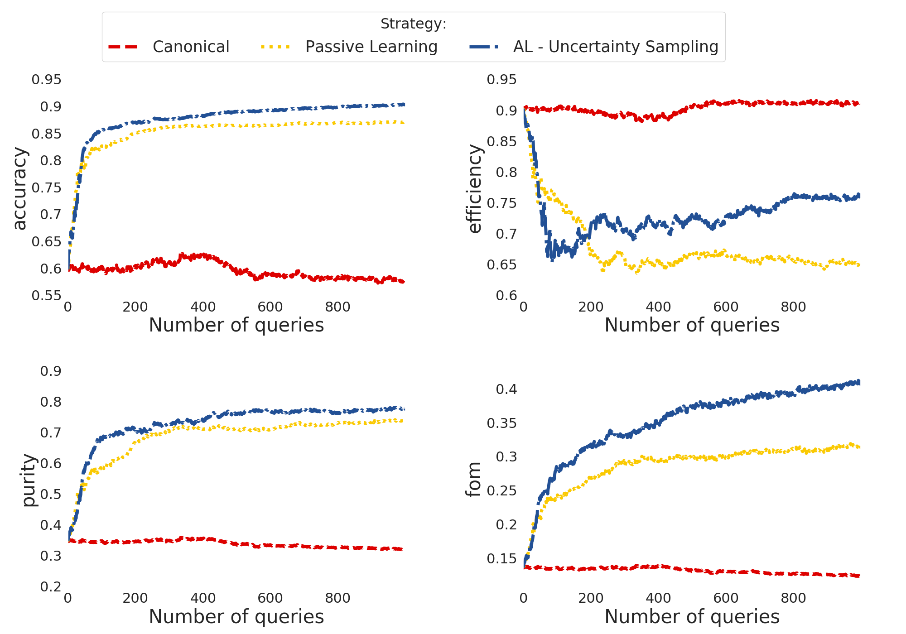

.. _plotting:
   :noindex:

Plotting
========

Once you have the diagnostic results for a set of learning strategies you can plot the behaviour the
evolution of the metrics:

 - Accuracy: fraction of correct classifications;
 - Efficiency: fraction of total SN Ia correctly classified;
 - Purity: fraction of correct Ia classifications;
 - Figure of merit: efficiency x purity with a penalty factor of 3 for false positives (contamination).

The class :py:class:`actsnclass.Canvas` enables you do to it using:

.. code-block:: python
   :linenos:

   >>> from actsnclass.plot_results import Canvas

   >>> # define parameters
   >>> path_to_files = ['results/metrics_canonical.dat',
   >>>                  'results/metrics_random.dat',
   >>>                  'results/metrics_unc.dat']
   >>> strategies_list = ['Canonical', 'RandomSampling', 'UncSampling']
   >>> output_plot = 'plots/diag.png'

   >>> #Initiate the Canvas object, read and plot the results for
   >>> # each diagnostic and strategy.
   >>> cv = Canvas()
   >>> cv.load_diagnostics(path_to_files=path_to_files,
   >>>                    strategies_list=strategies_list)
   >>> cv.set_plot_dimensions()
   >>> cv.plot_diagnostics(output_plot_file=output_plot,
   >>>                    strategies_list=strategies_list)

This will generate:

Alternatively, you can use  it directly from the command line.

For example, the result above could also be obtained doing:

.. code-block:: bash

    >>> make_diagnostic_plots.py -m <path to canonical diag> <path to rand sampling diag>  <path to unc sampling diag>
    >>>        -o <path to output plot file> -s Canonical RandomSampling UncSampling

OBS: the color pallete for this project was chosen to resemble the work of `Piet Mondrian <https://en.wikipedia.org/wiki/Piet_Mondrian>`_.