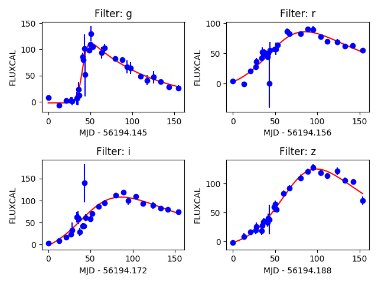

.. _preprocessing:

Feature Extraction
==================

The first stage in consists in transforming the raw data into a uniform data matrix which will subsequently be given
as input to the learning algorithm.

The original implementation of ``actsnclass`` can handle text-like data from the SuperNova Photometric Classification Challenge
(SNPCC) which is described in `Kessler et al., 2010 <https://arxiv.org/abs/1008.1024>`_.

This version is equiped to input ``RESSPECT`` simulatons made with the `SNANA simulator <http://snana.uchicago.edu/>`_.

Load 1 light curve: 
-------------------

For RESSPECT
^^^^^^^^^^^^

In order to fit a single light curve from the RESSPECT simulations you need to have its identification number. This information is stored in the header SNANA files. One of the possible ways to retrieve it is:

.. code-block:: python
    :linenos:

    >>> import io
    >>> import pandas as pd
    >>> import tarfile

    >>> path_to_header = '~/RESSPECT_PERFECT_V2_TRAIN_HEADER.tar.gz'

    # openning '.tar.gz' files requires some juggling ...
    >>> tar = tarfile.open(path_to_header, 'r:gz')
    >>> fname = tar.getmembers()[0]
    >>> content = tar.extractfile(fname).read()
    >>> header = pd.read_csv(io.BytesIO(content))
    >>> tar.close()

    # get keywords
    >>> header.keys()
    Index(['objid', 'redshift', 'type', 'code', 'sample'], dtype='object')

    # check the first chunks of ids and types
    >>> header[['objid', 'type']].iloc[:10]
       objid     type
    0   3228  Ibc_V19
    1   2241      IIn
    2   6770       Ia
    3    302      IIn
    4   7948       Ia
    5   4376   II_V19
    6    337   II_V19
    7   6017       Ia
    8   1695       Ia
    9   1660   II-NMF  

    >> snid = header['objid'].values[4]

Now that you have selected on object, you can fit its light curve using the `LightCurve class <https://actsnclass.readthedocs.io/en/resspect/api/actsnclass.LightCurve.html#actsnclass.LightCurve>`_ :

.. code-block:: python
    :linenos:

    >>> from actsnclass.fit_lightcurves import LightCurve

    >>> path_to_lightcurves = '~/RESSPECT_PERFECT_V2_TRAIN_LIGHTCURVES.tar.gz'

    >>> lc = LightCurve()
    >>> lc.load_resspect_lc(photo_file=path_to_lightcurves, snid=snid)

    # check light curve format
    >>> lc.photometry
              mjd band      flux   fluxerr        SNR
    0     53058.0    u  0.138225  0.142327   0.971179
    1     53058.0    g -0.064363  0.141841  -0.453768 
    ...       ...  ...       ...       ...        ...
    1054  53440.0    z  1.173433  0.145918   8.041707
    1055  53440.0    Y  0.980438  0.145256   6.749742

[1056 rows x 5 columns]

For PLAsTiCC:
^^^^^^^^^^^^^

    

For SNPCC:
^^^^^^^^^^

The raw data looks like this:

.. literalinclude:: images/DES_SN848233.DAT
 :lines: 1-61

You can load this data using:

.. code-block:: python
   :linenos:

   >>> from actsnclass.fit_lightcurves import LightCurve

   >>> path_to_lc = 'data/SIMGEN_PUBLIC_DES/DES_SN848233.DAT'

   >>> lc = LightCurve()                        # create light curve instance
   >>> lc.load_snpcc_lc(path_to_lc)             # read data
   >>> lc.photometry                            # check structure of photometry
             mjd band     flux  fluxerr   SNR
    0    56194.145    g   7.600    4.680   1.62
    1    56194.156    r   3.875    2.752   1.41
    ...        ...  ...      ...      ...   ...
    106  56348.008    z  70.690    6.706  10.54
    107  56348.996    g  26.000    5.581   4.66
    [108 rows x 5 columns]

Once the data is loaded, you can fit each individual filter to the parametric function proposed by
`Bazin et al., 2009 <https://arxiv.org/abs/0904.1066>`_ in one specific filter.

.. code-block:: python
   :linenos:

   >>> rband_features = lc.fit_bazin('r')
   >>> print(rband_features)
   [159.25796385, -13.39398527,  55.16210333, 111.81204143, -20.13492354]

The designation for each parameter are stored in:

.. code-block::python
   :linenos:

   >>> lc.bazin_features_names
   ['a', 'b', 't0', 'tfall', 'trsise']

It is possible to perform the fit in all filters at once and visualize the result using:

.. code-block:: python
   :linenos:

   >>> lc.fit_bazin_all()                            # perform Bazin fit in all filters
   >>> lc.plot_bazin_fit(save=True, show=True,
                         output_file='plots/SN' + str(lc.id) + '.png')   # save to file

Processing all light curves in the data set
^^^^^^^^^^^^^^^^^^^^^^^^^^^^^^^^^^^^^^^^^^^

There are 2 way to perform the Bazin fits for the entire SNPCC data set. Using a python interpreter,

.. code-block:: python
   :linenos:

   >>> from actsnclass import fit_snpcc_bazin

   >>> path_to_data_dir = 'data/SIMGEN_PUBLIC_DES/'            # raw data directory
   >>> output_file = 'results/Bazin.dat'                              # output file
   >>> fit_snpcc_bazin(path_to_data_dir=path_to_data_dir, features_file=output_file)

The above will produce a file called ``Bazin.dat`` in the `results` directory.

The same result can be achieved using the command line:

.. code-block:: bash

   >> fit_dataset.py -dd <path_to_data_dir> -o <output_file>
